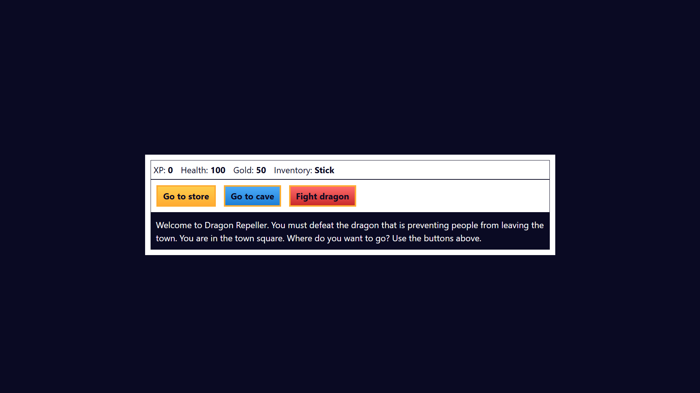

# 🐉 Dragon Repeller - A Simple RPG Game

Welcome to **Dragon Repeller**, a beginner-friendly browser-based RPG game built with **HTML**, **CSS**, and **JavaScript**. Your goal is to defeat the mighty dragon that blocks your path to freedom!

---

## 📌 Features

- 💥 Fight monsters and gain XP  
- 💰 Earn gold and buy better weapons  
- ⚔️ Upgrade your inventory and damage output  
- 🐲 Defeat the dragon and win the game!  
- 📱 Responsive design using Bootstrap 5  

---

## 🧩 Technologies Used

- HTML5  
- CSS3 (with custom styling)  
- JavaScript (vanilla)  
- Bootstrap 5.3 (for layout and styling)  

---

## 🎮 How to Play

1. Open `index.html` in your browser.  
2. Read the story and press the buttons to interact.  
3. Fight enemies, collect items, and upgrade your character.  
4. Your stats are displayed at the top.  
5. Defeat the final boss dragon to win the game!  

---

## 🙌 Credits

• Developed by Aldrin John Revale
• This project is inspired by the RPG game activity from freeCodeCamp's JavaScript Algorithms and Data Structures certification.
• Additional custom styling and layout enhancements by the developer

## 📃 License
This project is open source and free to use under the MIT License.

